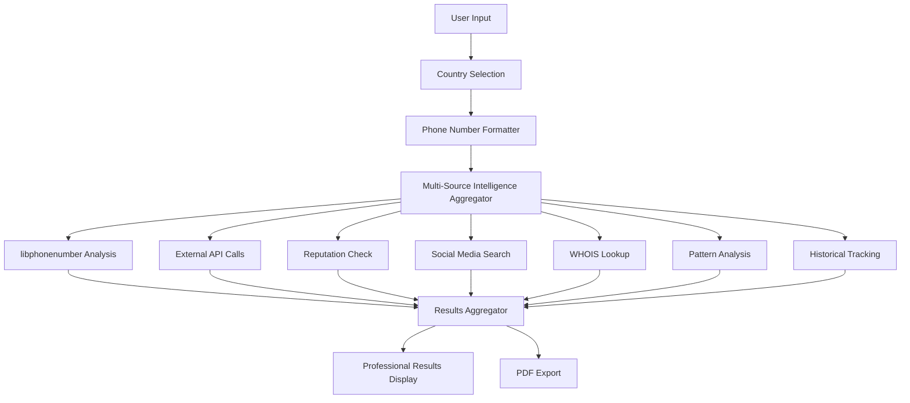

# Design Document

## Overview

The Enhanced Phone Investigation feature transforms the existing phone number lookup functionality into a comprehensive, professional-grade investigation tool. The design leverages Google's libphonenumber library for accurate parsing and validation, integrates multiple intelligence sources, and provides a sophisticated user interface with country selection capabilities.

## Architecture

### High-Level Architecture

```
┌─────────────────────────────────────────────────────────────────┐
│                    Enhanced Phone Investigation                  │
├─────────────────────────────────────────────────────────────────┤
│  UI Layer (surface_web_tab.py)                                 │
│  ├── Country Selection Dropdown                                │
│  ├── Input Validation & Format Examples                        │
│  └── Results Display with Organized Sections                   │
├─────────────────────────────────────────────────────────────────┤
│  Business Logic Layer (osint_utils.py)                         │
│  ├── Phone Number Formatter (libphonenumber)                   │
│  ├── Multi-Source Intelligence Aggregator                      │
│  ├── Historical Data Manager                                   │
│  └── Pattern Analysis Engine                                   │
├─────────────────────────────────────────────────────────────────┤
│  Data Sources Layer                                            │
│  ├── Google libphonenumber (Local)                             │
│  ├── External APIs (AbstractAPI, Neutrino, Find & Trace)       │
│  ├── Reputation Databases (HaveIBeenPwned, Spam Lists)         │
│  ├── Social Media APIs (WhatsApp, Telegram, LinkedIn)          │
│  ├── WHOIS Databases                                           │
│  └── Historical Data Store (Local SQLite)                      │
└─────────────────────────────────────────────────────────────────┘
```

### Component Architecture



## Components and Interfaces

### 1. Phone Number Formatter Component

**Purpose**: Handle multiple input formats and provide standardized phone number parsing using Google's libphonenumber.

**Interface**:
```python
class PhoneNumberFormatter:
    def format_phone_number(self, phone_input: str, default_country: str = 'IN') -> Dict:
        """
        Format phone number with multiple parsing attempts
        
        Args:
            phone_input: Raw phone number input
            default_country: ISO country code for parsing context
            
        Returns:
            Dict containing:
            - success: bool
            - best_format: Dict with formatted versions
            - parsing_attempts: List of all attempts
            - validation_results: Dict with validity info
        """
        
    def get_number_type_name(self, number_type) -> str:
        """Convert phonenumbers number type to readable name"""
        
    def validate_and_classify(self, parsed_number) -> Dict:
        """Comprehensive validation and classification"""
```

### 2. Multi-Source Intelligence Aggregator

**Purpose**: Coordinate data collection from multiple sources and provide unified results.

**Interface**:
```python
class IntelligenceAggregator:
    def gather_comprehensive_intelligence(self, phone_number: str, country_code: str) -> Dict:
        """
        Collect intelligence from all available sources
        
        Returns:
            Dict containing:
            - technical_intelligence: libphonenumber data
            - carrier_intelligence: API data
            - security_intelligence: spam/breach data
            - social_intelligence: social media presence
            - business_intelligence: WHOIS/domain data
            - pattern_intelligence: related numbers
            - historical_intelligence: change tracking
        """
        
    def calculate_confidence_score(self, intelligence_data: Dict) -> float:
        """Calculate overall investigation confidence"""
        
    def generate_risk_assessment(self, intelligence_data: Dict) -> Dict:
        """Generate comprehensive risk assessment"""
```

### 3. Country Selection Manager

**Purpose**: Manage country selection UI and provide country-specific formatting guidance.

**Interface**:
```python
class CountrySelectionManager:
    def get_supported_countries(self) -> List[Dict]:
        """Return list of supported countries with codes and examples"""
        
    def get_format_examples(self, country_code: str) -> Dict:
        """Get country-specific format examples and guidance"""
        
    def update_ui_for_country(self, country_code: str) -> None:
        """Update UI elements based on selected country"""
```

### 4. Historical Data Manager

**Purpose**: Track and analyze historical changes in phone number data.

**Interface**:
```python
class HistoricalDataManager:
    def store_investigation_data(self, phone_number: str, intelligence_data: Dict) -> None:
        """Store current investigation data for historical tracking"""
        
    def get_historical_data(self, phone_number: str) -> Dict:
        """Retrieve historical data for comparison"""
        
    def detect_changes(self, current_data: Dict, historical_data: Dict) -> Dict:
        """Detect and analyze changes over time"""
        
    def generate_change_timeline(self, phone_number: str) -> List[Dict]:
        """Generate chronological timeline of changes"""
```

### 5. Pattern Analysis Engine

**Purpose**: Identify related numbers and detect bulk registration patterns.

**Interface**:
```python
class PatternAnalysisEngine:
    def find_related_numbers(self, phone_number: str) -> List[Dict]:
        """Find numbers with similar patterns"""
        
    def detect_bulk_registration(self, phone_number: str) -> Dict:
        """Detect if number belongs to bulk registration block"""
        
    def analyze_sequential_patterns(self, phone_number: str) -> Dict:
        """Analyze sequential number patterns"""
        
    def calculate_relationship_confidence(self, number1: str, number2: str) -> float:
        """Calculate confidence score for number relationships"""
```

## Data Models

### Phone Investigation Result Model

```python
@dataclass
class PhoneInvestigationResult:
    # Basic Information
    original_input: str
    success: bool
    investigation_timestamp: datetime
    
    # Formatting Results
    formatting_success: bool
    formatting_method: str
    international_format: Optional[str]
    national_format: Optional[str]
    e164_format: Optional[str]
    rfc3966_format: Optional[str]
    
    # Technical Intelligence
    is_valid: bool
    is_possible: bool
    country_code: int
    country_name: str
    region_code: str
    location: str
    timezones: List[str]
    number_type: str
    is_mobile: bool
    is_fixed_line: bool
    
    # Carrier Intelligence
    carrier_name: str
    network_type: str
    roaming_indicators: Dict
    
    # Security Intelligence
    spam_risk_score: float
    spam_reports: List[Dict]
    breach_data: List[Dict]
    reputation_status: str
    
    # Social Intelligence
    social_media_presence: Dict
    whatsapp_status: Dict
    telegram_profile: Dict
    
    # Business Intelligence
    whois_domains: List[Dict]
    business_connections: List[Dict]
    
    # Pattern Intelligence
    related_numbers: List[Dict]
    bulk_registration_status: Dict
    
    # Historical Intelligence
    historical_changes: List[Dict]
    change_timeline: List[Dict]
    
    # Investigation Metadata
    confidence_score: float
    investigation_quality: str
    api_sources_used: List[str]
    total_sources: int
```

### Country Configuration Model

```python
@dataclass
class CountryConfig:
    country_code: str
    country_name: str
    display_name: str
    format_examples: List[str]
    validation_patterns: List[str]
    common_carriers: List[str]
    guidance_text: str
```

## Error Handling

### Error Handling Strategy

1. **Graceful Degradation**: If one intelligence source fails, others continue
2. **Fallback Mechanisms**: Multiple parsing attempts with different methods
3. **User-Friendly Messages**: Clear error messages with suggested actions
4. **Logging**: Comprehensive logging for debugging and monitoring

### Error Types and Handling

```python
class PhoneInvestigationError(Exception):
    """Base exception for phone investigation errors"""
    pass

class InvalidPhoneNumberError(PhoneInvestigationError):
    """Raised when phone number format is invalid"""
    def __init__(self, phone_number: str, attempted_formats: List[str]):
        self.phone_number = phone_number
        self.attempted_formats = attempted_formats
        super().__init__(f"Invalid phone number: {phone_number}")

class APIConnectionError(PhoneInvestigationError):
    """Raised when external API calls fail"""
    def __init__(self, api_name: str, error_message: str):
        self.api_name = api_name
        self.error_message = error_message
        super().__init__(f"API {api_name} failed: {error_message}")

class CountryNotSupportedError(PhoneInvestigationError):
    """Raised when selected country is not supported"""
    pass
```

## Testing Strategy

### Unit Testing

1. **Phone Number Formatting Tests**
   - Test all supported input formats
   - Test country-specific parsing
   - Test edge cases and invalid inputs

2. **Intelligence Aggregation Tests**
   - Mock external API responses
   - Test data merging logic
   - Test confidence scoring

3. **Pattern Analysis Tests**
   - Test related number detection
   - Test bulk registration detection
   - Test confidence calculations

### Integration Testing

1. **API Integration Tests**
   - Test real API calls with test numbers
   - Test error handling for API failures
   - Test rate limiting and retry logic

2. **UI Integration Tests**
   - Test country selection functionality
   - Test results display formatting
   - Test export functionality

### Performance Testing

1. **Response Time Tests**
   - Target: < 5 seconds for complete investigation
   - Test with various number formats
   - Test with different countries

2. **Concurrent Request Tests**
   - Test multiple simultaneous investigations
   - Test resource usage under load

## Implementation Plan

### Phase 1: Core Infrastructure (Week 1)
- Implement PhoneNumberFormatter with libphonenumber
- Create CountrySelectionManager
- Update UI with country selection dropdown
- Basic error handling and validation

### Phase 2: Intelligence Sources (Week 2)
- Integrate existing API sources with new formatter
- Implement reputation and spam checking
- Add social media search capabilities
- Create results aggregation logic

### Phase 3: Advanced Features (Week 3)
- Implement historical data tracking
- Add pattern analysis engine
- Create WHOIS and domain linkage
- Implement data breach checking

### Phase 4: UI Enhancement (Week 4)
- Enhanced results display with organized sections
- Professional formatting and styling
- Export functionality improvements
- User experience refinements

### Phase 5: Testing and Optimization (Week 5)
- Comprehensive testing suite
- Performance optimization
- Documentation and user guides
- Final integration and deployment

## Security Considerations

### Data Privacy
- No storage of investigated phone numbers without user consent
- Secure handling of API keys and credentials
- Compliance with data protection regulations

### API Security
- Rate limiting to prevent abuse
- Secure API key management
- Error handling that doesn't expose sensitive information

### User Safety
- Clear warnings about legal and ethical usage
- Guidance on responsible investigation practices
- Compliance reminders for different jurisdictions

## Performance Optimization

### Caching Strategy
- Cache libphonenumber parsing results
- Cache API responses for repeated queries
- Implement intelligent cache invalidation

### Asynchronous Processing
- Parallel API calls for faster results
- Non-blocking UI updates
- Progress indicators for long-running operations

### Resource Management
- Connection pooling for API calls
- Memory-efficient data structures
- Cleanup of temporary resources

## Monitoring and Analytics

### Investigation Metrics
- Success rates by country and format
- API response times and reliability
- User interaction patterns

### Error Tracking
- Comprehensive error logging
- Performance monitoring
- User feedback collection

### Quality Assurance
- Confidence score tracking
- Result accuracy validation
- Continuous improvement based on feedback